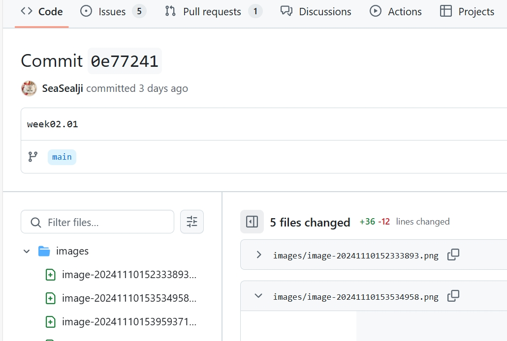
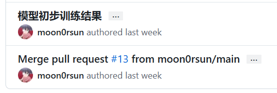
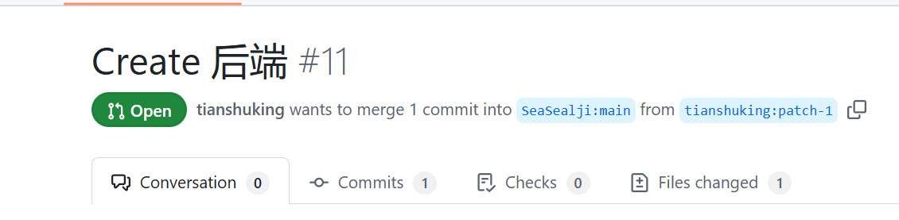

# 实验7：【Alpha 2/4】项目Alpha冲刺

## 一、基本情况

- **团队ID**：04
- **组长博客和小组GitHub地址**：
- 博客：https://blog.csdn.net/m0_73965132?spm=1010.2135.3001.5343
- GitHub：[SeaSealji/Project-SoftWare: 这是一个用于进行中国海洋大学软件工程原理与实践的课程作业仓库。](https://github.com/SeaSealji/Project-SoftWare)
- **小组成员**：刘海涵、刘奕鹏、吕茂宁

## 二、冲刺概况汇报

### 组员：刘海涵

- **过去完成了哪些任务**：

  - 完成了项目需求分析，明确SAR图像变化检测的主要功能和目标。
  - 与组员讨论界面设计，初步规划了用户上传功能和检测结果展示模块。
  - 完成GitHub项目仓库的搭建。
  - 开始前端页面的开发，尤其是用户上传和结果显示的设计。
  - 前端页面优化。
  - 维护项目仓库，小组进度统一协调。

- **文字描述**：

  讨论项目当前进展、分工情况及遇到的问题。 讨论了各成员的任务进度。前端上继续进行了开发，项目进度进行了一定推进。

- **GitHub签入记录**：

- **接下来的计划**：
  - 修改前端页面，进行项目管理
- **遇到的困难**：
  - 项目开发讨论问题不一致
- **收获和疑问**：
  - 对于技术需求和团队合作有了更深入的理解。

### 组员：刘奕鹏

- **过去完成了哪些任务**：
  - 研究了SAR图像变化检测算法，并对比了几种主流检测算法的优缺点。
  - 初步尝试了两幅SAR图像的预处理和初步检测。
  - 学习与模型改进：查询相关资料，完成对模型的改进。

- **文字描述**：
模型实现功能：
结果评价指标： 假警 (FA)：检测为变化但实际未变化的像素数。 漏检 (MA)：实际变化但未检测为变化的像素数。 总体错误率 (OE)：假警和漏检的总和。 总体分类准确率 (PCC)：正确分类像素的比例。 Kappa 系数 (KC)：衡量分类一致性与随机一致性差异的评价指标。
结果展示： 使用 plt.imshow(res, 'gray') 将最终变化检测结果显示为灰度图： 白色（255）：检测到的变化区域。 黑色（0）：未变化区域。
- **GitHub签入记录**：

- **接下来的计划**：
  - 深化对适合此任务的算法模型的分析，准备算法实现。
- **遇到的困难**：
  - 部分SAR图像质量不稳定，对比效果受影响。
- **收获和疑问**：
  - 了解到不同SAR图像的噪声处理方法。

### 组员：吕茂宁

- **过去完成了哪些任务**

  - 处理图像上传：接收前端上传的SAR图像文件。
  - 返回检测结果：将检测结果返回前端，用于展示变化区域。
  -后端代码实现。

- **文字描述**：实现了后端代码。

- **GitHub签入记录**：

- **接下来的计划**

  - 协助项目进展，完成算法接口开发。

- **遇到的困难**

  - 数据集处理需要时间，资源有限。

- **收获和疑问**

  - 对项目的整体结构有了更清晰的认识。

## 三、冲刺成果展示

- **最新成果展示**：

  - 前后端结合
  - 前端网页生成
  - flask后端代码生成
  - 算法实现

- **站立会议合照**：

- **会议记录**：
  - **时间**：2024年11月15日
  - **地点**：信息南楼B227。
  - **内容**：讨论项目当前进展、分工情况及遇到的问题。 讨论了各成员的任务进度。这一周大家实现了一些基础功能，各自部分都有一些进展，并打算实现项目的前后端结合，初步形成一个可用的样例，供以后使用。

