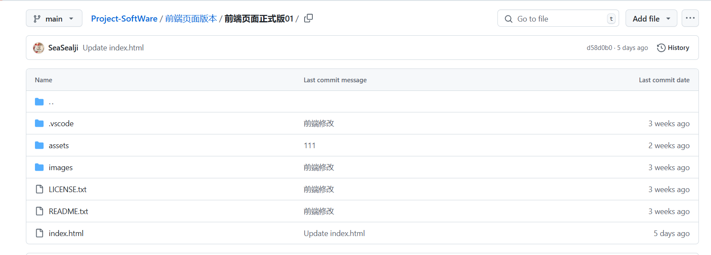
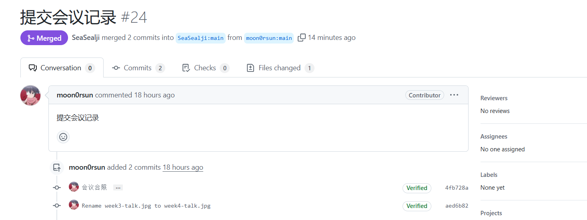
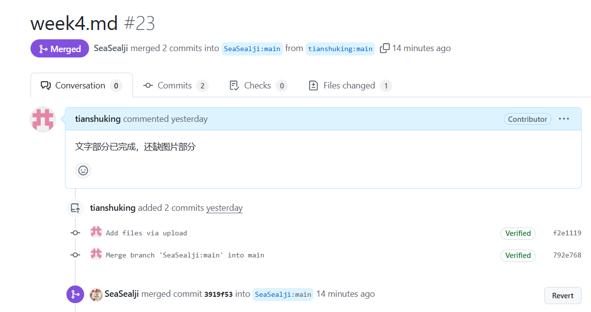

# 实验10：【Alpha 4/4】项目Alpha冲刺

## 一、基本情况

- **团队ID**：04
- **组长博客和小组GitHub地址**：[SeaSealji/Project-SoftWare: 这是一个用于进行中国海洋大学软件工程原理与实践的课程作业仓库。](https://github.com/SeaSealji/Project-SoftWare)
- **小组成员**：刘海涵、刘奕鹏、吕茂宁

## 二、冲刺概况汇报

### 组员：刘海涵

- **过去完成了哪些任务**：

  - 前端页面优化。
  - 共同协作完成模型的优化
  - 新增选择模型功能
  - 完善看板
  
- **文字描述**：

  在进行展示后，根据老师的意见进行修改增加了快慢两种模型的选择

- **GitHub签入记录**：
  
- **接下来的计划**：

  - 完善代码，监测可能出现的bug

- **遇到的困难**：

  - 模型的使用仍有一定的疑问

- **收获和疑问**：

  - 对于技术需求和团队合作有了更深入的理解，对前端的有关知识有了更深刻的理解。

### 组员：刘奕鹏

- **过去完成了哪些任务**：
  
  - 初步尝试了两幅SAR图像的预处理和初步检测。
  - 进行训练，并尝试优化模型
  - 在原来以及研读老师模型的基础上修改模型训练
  - 完成了模型的训练
  - 完善看板
  
- **文字描述**：

  进一步地完善了模型和训练

- **GitHub签入记录**：

- **接下来的计划**：
  - 模型的完善
  - 准备进行β迭代
  
- **遇到的困难**：
  - 结果实现时间较长，
  
- **收获和疑问**：
  
  - 对算法模型有了更深刻的理解，但仍需继续学习。

### 组员：吕茂宁

- **过去完成了哪些任务**

  - 前后端结合：将前后端代码进行结合，使程序正常运行
  - 协助进行模型的修改和优化
  - 完成新增的功能的后端部分
  - 完善看板
  
- **文字描述**：根据老师的指导完成新增加的功能。

- **GitHub签入记录**：

  

- **接下来的计划**
  - 对程序进行测试
  - 准备进行β迭代
- **遇到的困难**
  - 需要找到一个运行时间较短的模型
- **收获和疑问**
  - 对后端有关知识有了更深刻的了解
  - 对各种模型的了解还不够深刻

## 三、冲刺成果展示

- **最新成果展示**：

  - 课堂展示
  - 修改程序使其支持多模型选择
  - 前端页面的美化
  - 看板的使用

- **站立会议合照**：
  
- **会议记录**：
  - **时间**：2024年11月21日
  - **地点**：听海苑1号楼125宿舍。
  - **内容**：刘海涵负责前端以及项目管理，刘奕鹏进行模型的学习，吕茂宁进行后端开发。目前已完成了前后端的内容的结合，并经过测试没有出现明显的问题，并沟通了代码结构。同时，在本次会议我们共同研读了老师给的两个相关的论文并进行了理解和讨论，并结合我们目前已有的知识和已完成的模型，进行了模型未来想法的讨论，并规划了共同优化模型的分工和进度。
