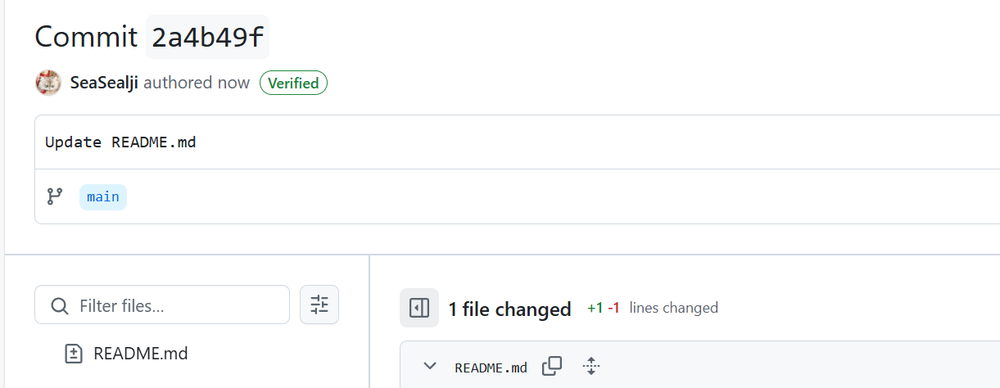
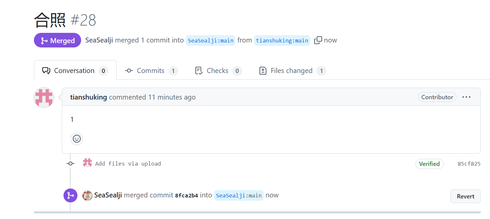
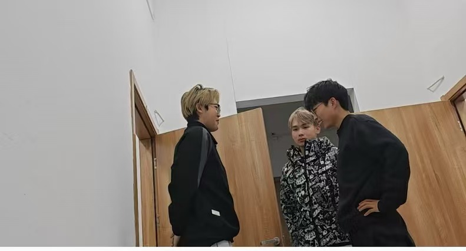

# 实验11：【Beta 1/4】项目Beta冲刺

## 一、基本情况

- **团队ID**：04
- **组长博客和小组GitHub地址**：[SeaSealji/Project-SoftWare: 这是一个用于进行中国海洋大学软件工程原理与实践的课程作业仓库。](https://github.com/SeaSealji/Project-SoftWare)
- **小组成员**：刘海涵、刘奕鹏、吕茂宁

## 二、冲刺概况汇报

### **Alpha 阶段问题总结随笔**

#### **1. 下一阶段需要改进完善和新增的功能**

- 功能改进 ：

  - 提升前端页面美观性和用户体验。
  - 优化 SAR 图像变化检测模型的效率，减少处理时间。
  - 加强模型结果的可视化，提供更详细的变化区域标注。

- 新增功能 ：

  - 增加用户选择模型的功能，支持不同精度与速度需求。
  - 开发结果下载功能，方便用户保存检测结果。

#### **2. 需要改进的团队分工**

- 提高任务分配的明确性，避免任务重复或遗漏。
- 增强团队内的跨领域协作能力：
  - **刘海涵**：专注于前端开发和项目管理，增加与后端的沟通频率。
  - **刘奕鹏**：深入研究模型优化，与后端联调更多测试场景。
  - **吕茂宁**：优化后端逻辑，与前端协作提升数据交互稳定性。

#### **3. 需要改进的工具和流程**

- 版本控制：

  - 增强 Git 操作规范，确保每次提交都附有详细说明。
  - 增加代码评审流程，提升代码质量。

- 测试工具 ：

  - 引入自动化测试工具，确保前后端接口功能正确。
  - 针对不同的 SAR 数据集开发更多单元测试用例，覆盖边缘情况。

- 项目管理：

  - 使用如 Trello 或 GitHub Projects 等工具，加强任务跟踪与进度监控。

#### **4. 后续计划安排**

- 短期目标

  （Beta 冲刺前两周）：

  - 前端：完成页面美化及上传/显示功能优化。
  - 模型：优化现有检测模型，提升运行速度。
  - 后端：完善接口功能，增加日志记录以便排查问题。

- 长期目标

  （Beta 冲刺最后两周）：

  - 实现完整的用户工作流测试，包括数据上传、检测、结果下载。
  - 修复所有已知问题，确保项目稳定性。
  - 整理项目文档，方便后续维护与扩展。

#### **总结与反思**

通过 Alpha 阶段的实践，我们深刻体会到软件工程的“Learning by Doing”精神。尽管过程中遇到了许多困难，例如对新技术的不熟悉、团队协作不顺畅等，但这些都促使我们快速学习和成长。接下来，我们将更加注重规划与协作，以确保 Beta 阶段冲刺的成功。
### 组员：刘海涵

- **过去完成了哪些任务**：

  - 前端页面优化。
  - 完善前端代码，修复了已知bug
  - 测试并优化了用户界面的响应速度。
  - 深入研究模型选择功能，确保其稳定性。
  
- **文字描述**：

  根据上次冲刺后的反馈，我们对前端进行了进一步的优化，特别是针对模型选择功能做了深入调试，保证了不同模型切换时的流畅性和准确性。同时，也加强了前端页面的兼容性测试，以适应更多种类的浏览器和设备。

- **GitHub签入记录**：
  
- **接下来的计划**：

  - 持续监控前端性能，准备根据用户反馈做进一步调整。
  - 探索新的前端技术和框架，为后续版本做技术储备。

- **遇到的困难**：

  - 在处理跨浏览器兼容问题时遇到了一些挑战，特别是在某些旧版本浏览器上的表现不尽人意。

- **收获和疑问**：

  - 对前端开发中的性能优化有了更深刻的认识，学会了如何通过减少HTTP请求、压缩资源文件等方式提高页面加载速度。
  - 仍然存在关于如何更好地实现前后端分离架构的问题，希望能在接下来的学习中找到答案。

### 组员：刘奕鹏

- **过去完成了哪些任务**：
  
  - 继续优化现有模型，提高了检测精度。
  - 进行训练，并尝试优化模型
  - 研究并引入了新的变化检测模型，缩短了训练时间。
  - 完成了模型的训练
  - 完善看板
  
- **文字描述**：

  我们在原有基础上进一步改进了模型，不仅提高了其准确性，还减少了训练所需的时间。此外，为了提升用户体验，我们正在考虑加入自动更新的功能，使得用户能够无需手动操作就能获取最新的模型和算法。

- **GitHub签入记录**：

- **接下来的计划**：
  - 模型的完善
  - 准备详细的文档，以便其他成员理解和使用这些新特性。
  
- **遇到的困难**：
  - 新的处理方法虽然有效，但结果相较之前不太准确，这可能会影响到一部分用户的使用体验。
  
- **收获和疑问**：
  
  - 学习到了更多关于机器学习的知识，尤其是在SAR图像处理方面有了长足的进步。
  - 对于如何平衡模型性能和计算成本之间的关系还有待探索。

### 组员：吕茂宁

- **过去完成了哪些任务**

  - 完成了后端API的全面测试，确保所有接口稳定运行。
  - 研究并引入了新的变化检测模型，缩短了训练时间。
  - 优化了数据库查询语句，提升了数据访问效率。
  - 集成了第三方服务，增强了系统的功能。
  - 完善看板
  
- **文字描述**：本冲刺期内，主要集中在后端的稳定性和性能上。通过一系列的优化措施，显著提高了后端服务的响应速度和可靠性。

- **GitHub签入记录**：

  

- **接下来的计划**
  - 对程序进行测试
  - 继续优化后端性能，特别是对于大数据量的处理能力。
  - 准备部署到生产环境，开始小规模的用户测试。
- **遇到的困难**
  - 运行时间较短的模型变化检测效果并不是很耦合正确结果
- **收获和疑问**
  - 对后端有关知识有了更深刻的了解
  - 对各种模型的了解还不够深刻

## 三、冲刺成果展示

- **最新成果展示**：

  - 展示了优化后的多模型选择功能，用户可以根据需求快速切换不同的模型。
  - 修改程序使其支持多模型选择，以进行快速处理
  - 前端页面得到了进一步美化，用户体验得到提升。

    

- **站立会议合照**：
  
  
- **会议记录**：
  - **时间**：2024年12月6日
  - **地点**：听海苑1号楼125宿舍。
  - **内容**：刘海涵负责前端优化的实现，刘奕鹏进行模型优化和新特性设计，吕茂宁进行后端性能提升的实现。我们共同讨论了下一步的工作重点，即准备进入β阶段的用户测试，并着手解决可能出现的问题。同时，我们也明确了各自的任务分工，确保项目的顺利推进。
