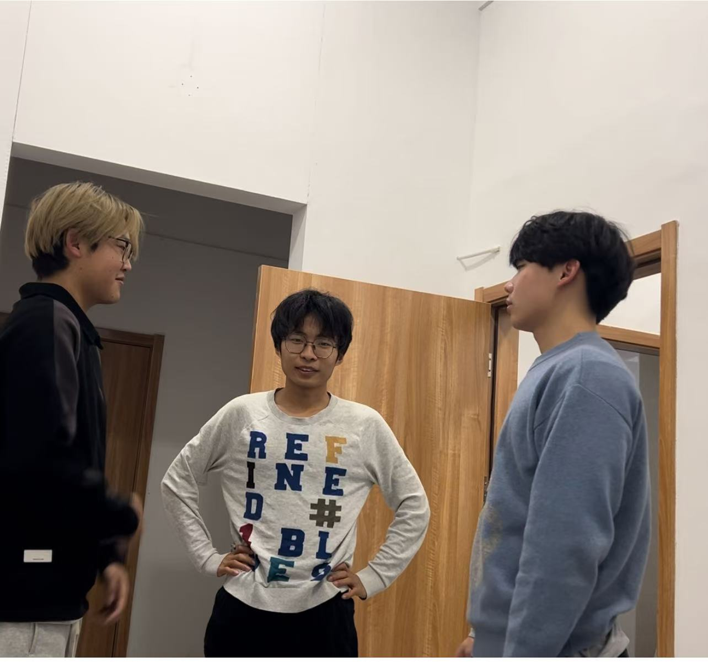

# 实验11：【Beta 1/4】项目Beta冲刺

## 一、基本情况

- **团队ID**：04
- **组长博客和小组GitHub地址**：[SeaSealji/Project-SoftWare: 这是一个用于进行中国海洋大学软件工程原理与实践的课程作业仓库。](https://github.com/SeaSealji/Project-SoftWare)
- **小组成员**：刘海涵、刘奕鹏、吕茂宁

## 二、冲刺概况汇报

### alpha阶段问题总结随笔具体要求

### 组员：刘海涵

- **过去完成了哪些任务**：

  - 前端页面优化。
  - 完善前端代码，修复了已知bug
  - 测试并优化了用户界面的响应速度。
  - 深入研究模型选择功能，确保其稳定性。
  
- **文字描述**：

  根据上次冲刺后的反馈，我们对前端进行了进一步的优化，特别是针对模型选择功能做了深入调试，保证了不同模型切换时的流畅性和准确性。同时，也加强了前端页面的兼容性测试，以适应更多种类的浏览器和设备。

- **GitHub签入记录**：
  
- **接下来的计划**：

  - 持续监控前端性能，准备根据用户反馈做进一步调整。
  - 探索新的前端技术和框架，为后续版本做技术储备。

- **遇到的困难**：

  - 在处理跨浏览器兼容问题时遇到了一些挑战，特别是在某些旧版本浏览器上的表现不尽人意。

- **收获和疑问**：

  - 对前端开发中的性能优化有了更深刻的认识，学会了如何通过减少HTTP请求、压缩资源文件等方式提高页面加载速度。
  - 仍然存在关于如何更好地实现前后端分离架构的问题，希望能在接下来的学习中找到答案。

### 组员：刘奕鹏

- **过去完成了哪些任务**：
  
  - 继续优化现有模型，提高了检测精度。
  - 进行训练，并尝试优化模型
  - 研究并引入了新的变化检测模型，缩短了训练时间。
  - 完成了模型的训练
  - 完善看板
  
- **文字描述**：

  我们在原有基础上进一步改进了模型，不仅提高了其准确性，还减少了训练所需的时间。此外，为了提升用户体验，我们正在考虑加入自动更新的功能，使得用户能够无需手动操作就能获取最新的模型和算法。

- **GitHub签入记录**：

- **接下来的计划**：
  - 模型的完善
  - 准备详细的文档，以便其他成员理解和使用这些新特性。
  
- **遇到的困难**：
  - 新的处理方法虽然有效，但结果相较之前不太准确，这可能会影响到一部分用户的使用体验。
  
- **收获和疑问**：
  
  - 学习到了更多关于机器学习的知识，尤其是在SAR图像处理方面有了长足的进步。
  - 对于如何平衡模型性能和计算成本之间的关系还有待探索。

### 组员：吕茂宁

- **过去完成了哪些任务**

  - 完成了后端API的全面测试，确保所有接口稳定运行。
  - 研究并引入了新的变化检测模型，缩短了训练时间。
  - 优化了数据库查询语句，提升了数据访问效率。
  - 集成了第三方服务，增强了系统的功能。
  - 完善看板
  
- **文字描述**：本冲刺期内，主要集中在后端的稳定性和性能上。通过一系列的优化措施，显著提高了后端服务的响应速度和可靠性。

- **GitHub签入记录**：

  

- **接下来的计划**
  - 对程序进行测试
  - 继续优化后端性能，特别是对于大数据量的处理能力。
  - 准备部署到生产环境，开始小规模的用户测试。
- **遇到的困难**
  - 运行时间较短的模型变化检测效果并不是很耦合正确结果
- **收获和疑问**
  - 对后端有关知识有了更深刻的了解
  - 对各种模型的了解还不够深刻

## 三、冲刺成果展示

- **最新成果展示**：

  - 展示了优化后的多模型选择功能，用户可以根据需求快速切换不同的模型。
  - 修改程序使其支持多模型选择，以进行快速处理
  - 前端页面得到了进一步美化，用户体验得到提升。

    

- **站立会议合照**：
  
- **会议记录**：
  - **时间**：2024年12月6日
  - **地点**：听海苑1号楼125宿舍。
  - **内容**：刘海涵负责前端优化的实现，刘奕鹏进行模型优化和新特性设计，吕茂宁进行后端性能提升的实现。我们共同讨论了下一步的工作重点，即准备进入β阶段的用户测试，并着手解决可能出现的问题。同时，我们也明确了各自的任务分工，确保项目的顺利推进。
