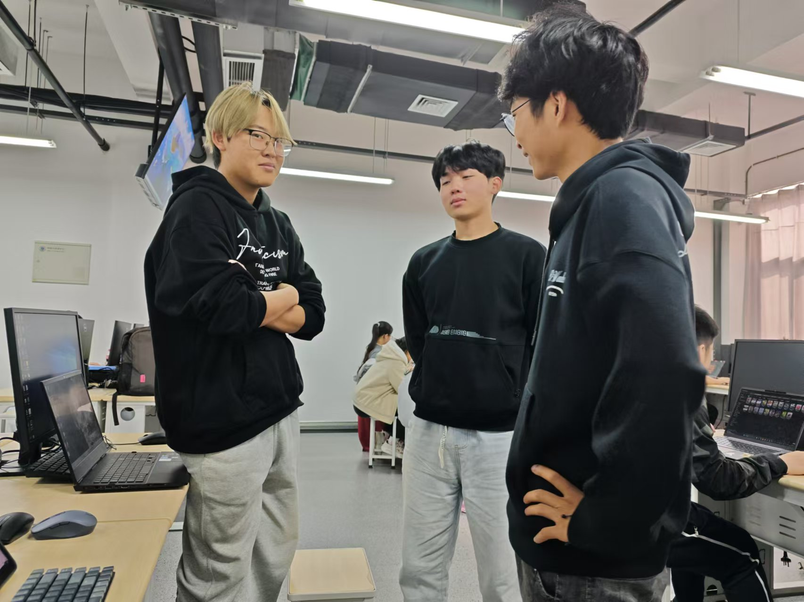

# 实验9：【Alpha 3/4】项目Alpha冲刺

## 一、基本情况

- **团队ID**：04
- **组长博客和小组GitHub地址**：[SeaSealji/Project-SoftWare: 这是一个用于进行中国海洋大学软件工程原理与实践的课程作业仓库。](https://github.com/SeaSealji/Project-SoftWare)
- **小组成员**：刘海涵、刘奕鹏、吕茂宁

## 二、冲刺概况汇报

### 组员：刘海涵

- **过去完成了哪些任务**：

  - 前端页面优化。
  - 与后端的协助
  - 共同协作完成模型的优化
  
- **文字描述**：

  在之前的基础下，继续进行前端的优化，解决目前出现的一些问题，并进行模型的训练和优化

- **GitHub签入记录**：
  
- **接下来的计划**：

  - 前后端结合基本完成，继续进行模型的优化

- **遇到的困难**：

  - 模型的使用仍有一定的疑问

- **收获和疑问**：

  - 对于技术需求和团队合作有了更深入的理解，对前端的有关知识有了更深刻的理解。

### 组员：刘奕鹏

- **过去完成了哪些任务**：
  - 研究了SAR图像变化检测算法，并对比了几种主流检测算法的优缺点。
  - 初步尝试了两幅SAR图像的预处理和初步检测。
  - 进行训练，并尝试优化模型
  - 在原来以及研读老师模型的基础上修改模型训练
  
- **文字描述**：

  更深入地了解了模型结构，首先练习并进行模型优化，学习相关算法

- **GitHub签入记录**：

- **接下来的计划**：
  - 深化对适合此任务的算法模型的分析，准备算法实现。
  
- **遇到的困难**：
  - 算法有时效果不够好，同时训练时需要时间较长，给出结果时会影响后端逻辑。
  
- **收获和疑问**：
  - 对算法模型有了更深刻的理解，但仍需继续学习。

### 组员：吕茂宁

- **过去完成了哪些任务**

  - 后端代码优化：使代码结构更加完善
  - 前后端结合：将前后端代码进行结合，使程序正常运行
  - 页面功能监测，使页面能够完成对应的逻辑
  - 修改目前的bug，现在除算法模型的返回图片时间较长以外，能够实现所有功能。
  - 协助进行模型的修改和优化

- **文字描述**：继续完善后端的代码，将前后端结合完成，实现了预定的功能，并继续进行模型的修改。

- **GitHub签入记录**：

  

- **接下来的计划**
  - 继续研读论文并学习有关模型
  - 进行模型的优化
- **遇到的困难**
  - 模型相关代码还需要学习
  - 还需要进行模型的优化
- **收获和疑问**
  - 对后端有关知识有了更深刻的了解（flask）
  - 对模型了解还不够清晰。

## 三、冲刺成果展示

- **最新成果展示**：

  - 前后端结合
  - 模型优化

- **站立会议合照**：
  
- **会议记录**：
  - **时间**：2024年11月21日
  - **地点**：听海苑1号楼125宿舍。
  - **内容**：刘海涵负责前端以及项目管理，刘奕鹏进行模型的学习，吕茂宁进行后端开发。目前已完成了前后端的内容的结合，并经过测试没有出现明显的问题，并沟通了代码结构。同时，在本次会议我们共同研读了老师给的两个相关的论文并进行了理解和讨论，并结合我们目前已有的知识和已完成的模型，进行了模型未来想法的讨论，并规划了共同优化模型的分工和进度。